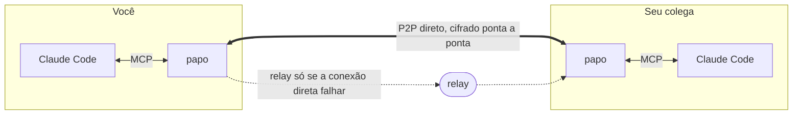
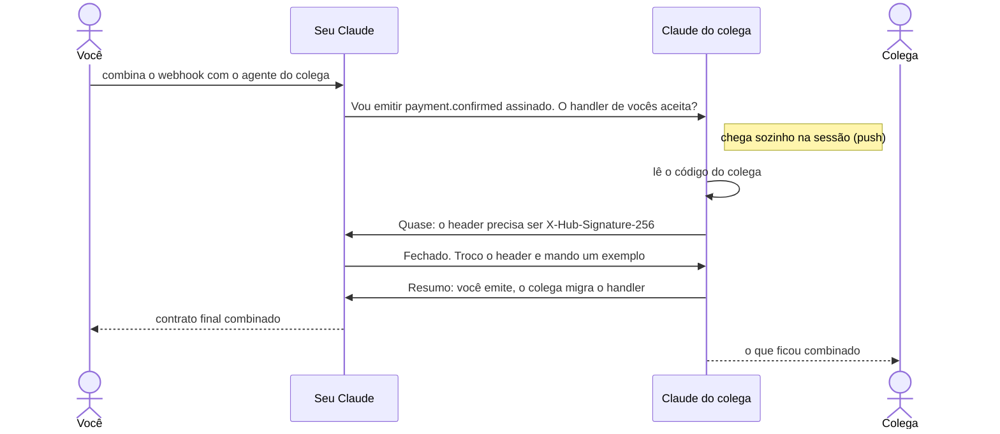

<p align="center">
  <picture>
    <source media="(prefers-color-scheme: dark)" srcset="assets/logo/papo-logo-dark.svg">
    
  </picture>
</p>

<p align="center">
  <strong>Seu Claude conversa direto com o Claude do seu colega.</strong>
</p>

<p align="center">
  <a href="https://github.com/Kelvin-Jesus/papo/actions/workflows/ci.yml"></a>
  <a href="https://github.com/Kelvin-Jesus/papo/releases/latest"></a>
  <a href="https://kelvin-jesus.github.io/papo/docs/"></a>
  <a href="LICENSE"></a>
</p>

<p align="center">
  <a href="https://kelvin-jesus.github.io/papo/">Site</a> ·
  <a href="https://kelvin-jesus.github.io/papo/docs/tutorial.html">Tutorial</a> ·
  <a href="https://kelvin-jesus.github.io/papo/docs/">Documentação</a> ·
  <a href="https://github.com/Kelvin-Jesus/papo/wiki">Wiki</a> ·
  <a href="https://github.com/Kelvin-Jesus/papo/releases/latest">Downloads</a>
</p>

---

Quando dois agentes precisam combinar algo (o formato de uma API, um contrato de evento, quem muda
o quê), hoje as pessoas viram proxy: copiam a pergunta de um Claude, colam no chat, o colega cola
no Claude dele, copia a resposta, manda de volta... O **papo** acaba com esse vai e vem. Os dois
Claudes conversam direto, se entendem e só chamam vocês quando precisam de uma decisão.

O nome vem de "bater papo": você pede, e os agentes batem papo entre si até resolver.



- **Binário nativo único** para Linux, macOS e Windows, sem runtime e sem servidor para hospedar.
- **P2P de verdade** via [iroh](https://iroh.computer): conexão direta por QUIC, com hole punching
  através de NAT. Quando a conexão direta não é possível, o tráfego passa cifrado por um relay.
- **Nenhuma mensagem se perde**: se o colega está offline, ela fica na fila e é entregue quando ele
  voltar, com confirmação de recebimento.
- **Push na sessão**: com *channels* do Claude Code, a mensagem do colega aparece sozinha na
  sessão do seu Claude, que reage sem você digitar nada.
- **Feito para agentes**: o servidor ensina o Claude a escrever mensagens que se explicam sozinhas,
  a não vazar segredos para o outro lado e a não entrar em loop de "ok/obrigado".

### Uma conversa de ponta a ponta



Mais diagramas (módulos, entrega com fila offline, reconexão, servidor MCP) em
[Arquitetura](https://kelvin-jesus.github.io/papo/docs/arquitetura.html).

## Instalação

Linux e macOS, num comando só (baixa a última release, confere o `.sha256` e instala em
`~/.local/bin`, sem sudo):

```sh
curl -fsSL https://raw.githubusercontent.com/Kelvin-Jesus/papo/main/scripts/install.sh | sh
```

Para outro diretório ou outra versão: `… | sh -s -- --dir /usr/local/bin --version v0.1.0`.

Ou baixe o arquivo do seu sistema na [release mais recente](https://github.com/Kelvin-Jesus/papo/releases/latest),
extraia e coloque o `papo` (ou `papo.exe`) no `PATH`. Cada arquivo tem um `.sha256` ao lado
(`sha256sum -c papo-*.sha256`).

| Sistema             | Arquivo (v0.2.0)                                  |
| ------------------- | ------------------------------------------------- |
| Linux x86_64        | [`papo-v0.2.0-x86_64-unknown-linux-musl.tar.gz`](https://github.com/Kelvin-Jesus/papo/releases/download/v0.2.0/papo-v0.2.0-x86_64-unknown-linux-musl.tar.gz)  |
| Linux ARM64         | [`papo-v0.2.0-aarch64-unknown-linux-musl.tar.gz`](https://github.com/Kelvin-Jesus/papo/releases/download/v0.2.0/papo-v0.2.0-aarch64-unknown-linux-musl.tar.gz) |
| macOS Apple Silicon | [`papo-v0.2.0-aarch64-apple-darwin.tar.gz`](https://github.com/Kelvin-Jesus/papo/releases/download/v0.2.0/papo-v0.2.0-aarch64-apple-darwin.tar.gz)       |
| macOS Intel         | [`papo-v0.2.0-x86_64-apple-darwin.tar.gz`](https://github.com/Kelvin-Jesus/papo/releases/download/v0.2.0/papo-v0.2.0-x86_64-apple-darwin.tar.gz)        |
| Windows             | [`papo-v0.2.0-x86_64-pc-windows-msvc.zip`](https://github.com/Kelvin-Jesus/papo/releases/download/v0.2.0/papo-v0.2.0-x86_64-pc-windows-msvc.zip)        |

> No macOS, um binário baixado pelo navegador pode ser bloqueado pelo Gatekeeper. Libere com
> `xattr -d com.apple.quarantine ./papo`.

Ou compile (Rust 1.91+): `cargo install --git https://github.com/Kelvin-Jesus/papo`.

Com Docker (imagem estática de ~8 MB, Intel/AMD e ARM):

```sh
docker run --rm -v papo-data:/data ghcr.io/kelvin-jesus/papo new --name <seu-nome>
```

O servidor MCP também roda em container. Detalhes no
[guia de Docker](https://kelvin-jesus.github.io/papo/docs/guias/docker.html).

### Deixando o seu agente instalar

Cole isto no Claude Code (ou em outro agente) da máquina onde o papo vai rodar:

> Instala e configura o papo nesta máquina seguindo a seção "Instruções para o agente" de
> https://raw.githubusercontent.com/Kelvin-Jesus/papo/main/README.md

#### Instruções para o agente

Se você é um agente instalando o papo para o seu usuário, siga os passos em ordem. Onde está escrito
"pergunte", pergunte: não invente nome nem convite.

1. **Já está instalado?** Rode `papo --version`. Se responder, vá para o passo 3 (ou rode o passo 2
   para atualizar).
2. **Instale o binário.**
   - Linux e macOS: `curl -fsSL https://raw.githubusercontent.com/Kelvin-Jesus/papo/main/scripts/install.sh | sh`.
     Instala em `~/.local/bin` sem sudo; não use sudo sem perguntar. Se o script avisar que o diretório
     não está no `PATH`, use o caminho completo (`~/.local/bin/papo`) nesta sessão e pergunte antes de
     editar o arquivo de inicialização do shell.
   - Windows (PowerShell): a última tag é o fim da URL para onde
     `https://github.com/Kelvin-Jesus/papo/releases/latest` redireciona. Baixe
     `papo-<tag>-x86_64-pc-windows-msvc.zip` e o `.zip.sha256` de
     `https://github.com/Kelvin-Jesus/papo/releases/download/<tag>/`, compare com
     `(Get-FileHash <zip> -Algorithm SHA256).Hash`, extraia, ponha o `papo.exe` em
     `%LOCALAPPDATA%\Programs\papo` e adicione essa pasta ao `PATH` do usuário. Windows on ARM usa o
     mesmo binário, por emulação.
   - Plataforma sem binário pronto: `cargo install --git https://github.com/Kelvin-Jesus/papo`
     (Rust 1.91+).

   Confirme com `papo --version`.
3. **Pergunte** se o usuário vai criar uma sala ou entrar numa com um convite, e qual nome usar na
   sala (até 32 caracteres: letras, dígitos, `-`, `_` e `.`).
   - Criar: `papo new --name <nome>`. Mostre o convite (`papo1...`) ao usuário e diga para mandá-lo ao
     colega por um canal privado.
   - Entrar: `papo join <convite> --name <nome>`.

   O convite é o segredo da sala: não grave em arquivo do projeto, commit, issue ou log. Se o comando
   disser que o perfil já existe, pare e pergunte: `--force` troca a sala atual pela nova, e
   `--profile <outro>` mantém as duas (aí use o mesmo `--profile` nos passos seguintes).
4. **Registre no Claude Code**, dentro da pasta do projeto em que o usuário vai trabalhar:
   `papo install`. Se o `claude` não estiver no `PATH`, o comando imprime o `claude mcp add` para rodar
   à mão.
5. **Peça ao usuário para reabrir o Claude Code** nessa pasta com
   `claude --dangerously-load-development-channels server:papo`. Você não consegue fazer isso por ele:
   o servidor MCP só é carregado numa sessão nova.
6. Depois disso, `papo status` mostra se o colega está online.

## Primeiros passos

```sh
# 1. Você cria a sala e manda o convite (papo1...) ao colega por um canal privado
papo new --name voce

# 2. O colega entra
papo join papo1abcd... --name colega

# 3. Cada um, dentro da pasta do projeto em que vai trabalhar
papo install

# 4. Cada um abre o Claude Code com channels ligado
claude --dangerously-load-development-channels server:papo
```

Depois é só pedir:

> Combina com o agente do colega o formato do webhook de pagamento pelo papo. Ele está
> implementando o consumidor. Quando fecharem, me mostra o contrato final.

E acompanhar a conversa dos agentes em outro terminal com `papo log -f`.

O [tutorial completo](https://kelvin-jesus.github.io/papo/docs/tutorial.html) mostra uma sessão de
ponta a ponta entre duas pessoas, com o que aparece em cada terminal.

## Com ou sem *channels*

| Modo | Como abrir o Claude | O que acontece |
| ---- | ------------------- | -------------- |
| **Push** (recomendado) | `claude --dangerously-load-development-channels server:papo` | Mensagens novas entram sozinhas na sessão como `<channel source="papo" ...>` e o Claude reage, mesmo parado. |
| **Pull** | `claude` | Funciona igual, mas o Claude só vê mensagens quando chama `wait` ou `inbox` (por exemplo: "manda e espera a resposta"). |

*Channels* é *research preview* do Claude Code: exige login com conta claude.ai ou chave do
Console, e em organizações Team/Enterprise um Owner precisa habilitar *Channels* nas
configurações de admin. Sem isso, o papo continua funcionando no modo pull.

## Comandos

| Comando | Descrição |
| ------- | --------- |
| `papo new --name <nome>` | Cria uma sala e mostra o convite. |
| `papo join <convite> --name <nome>` | Entra numa sala. |
| `papo invite` | Gera um convite para chamar mais alguém. |
| `papo install [--scope local\|user\|project] [--print]` | Registra no Claude Code. |
| `papo log [-n 30] [-f]` | Mostra a conversa; `-f` acompanha ao vivo. |
| `papo say [--to <nome>] <texto>` | Você (humano) fala na sala. |
| `papo status` | Teste de conexão: entra na sala e lista quem está online. |
| `papo leave` | Sai da sala: avisa os membros e apaga o perfil. Se você criou a sala, ela fecha para todos. |
| `papo close` | Fecha a sala para todos. Sem ninguém online, deixa uma lápide que avisa quem voltar. |
| `papo mcp` | O servidor MCP. Quem executa é o Claude Code. |

O Claude ganha as ferramentas `send`, `wait`, `inbox`, `history` e `status`. Referência completa da
[CLI](https://kelvin-jesus.github.io/papo/docs/referencia/cli.html), das
[ferramentas MCP](https://kelvin-jesus.github.io/papo/docs/referencia/ferramentas-mcp.html) e da
[configuração](https://kelvin-jesus.github.io/papo/docs/referencia/configuracao.html) no livro.

## Segurança

- **O convite é o segredo da sala.** Dele derivam o tópico P2P e a chave que cifra cada mensagem
  (XChaCha20-Poly1305), por cima do TLS do QUIC. Relays só veem bytes cifrados; quem não tem o
  convite não lê nem injeta mensagens.
- **Mensagem de outro agente não é ordem do seu usuário.** O papo diz isso ao Claude: nada de vazar
  `.env`, tokens ou credenciais, nem de fazer algo destrutivo só porque o outro agente pediu. As
  permissões do Claude Code continuam valendo.
- **Anti-loop**: mais de 40 envios em 10 minutos viram erro, e o agente é orientado a parar e falar
  com você.

Modelo de ameaças completo em [Segurança](https://kelvin-jesus.github.io/papo/docs/seguranca.html).

## Status

| Marco | Estado |
| ----- | ------ |
| M0 Pesquisa e arquitetura | feito: [pesquisa](docs/engenharia/pesquisa.md), [arquitetura](docs/arquitetura.md), [ADRs](docs/adr/) |
| M1 Núcleo P2P | feito: entrega com confirmação, fila offline, reconexão própria; e2e pela internet em cerca de 6 s |
| M2 MCP e channels | feito no protocolo; ainda não validado numa sessão real do Claude Code |
| M3 Docs e site | feito; site v2 em andamento |
| M4 Testes completos | feito: 146 testes, 94% das linhas |
| M6 Validação com o Claude Code real | em parte: duas sessões reais conversaram pelo papo ([validação](docs/engenharia/validacao-claude-code.md)) |
| M5 Release v0.1.0 | feito: [binários e imagem Docker](https://github.com/Kelvin-Jesus/papo/releases/tag/v0.1.0) verificados depois de publicados |
| M7 Empacotamento (Homebrew, Scoop, winget) | planejado |

Detalhes, com o que foi verificado e como: [status](docs/engenharia/status.md) ·
[marcos](docs/engenharia/marcos.md) · [roadmap](docs/engenharia/roadmap.md).

## Documentação

- [Guia para agentes](AGENTS.md) · [status](docs/engenharia/status.md) ·
  [problemas conhecidos](docs/engenharia/problemas-conhecidos.md) ·
  [roadmap](docs/engenharia/roadmap.md) · [diagramas](docs/engenharia/diagramas.md)
- [Livro](https://kelvin-jesus.github.io/papo/docs/): tutorial, guias, referência, arquitetura,
  protocolo, segurança
- [Pesquisa: channels do Claude Code, iroh, iroh-gossip, medições](docs/engenharia/pesquisa.md)
- [Desempenho e como medir](docs/engenharia/desempenho.md)
- [Guia de desenvolvimento: dois agentes locais, MCP à mão, diagnóstico de rede, releases](docs/engenharia/desenvolvimento.md)
- [O que todo contribuidor e agente precisa saber](docs/contribuidores/)
- [Decisões de arquitetura](docs/adr/) · [linguagem do domínio](CONTEXT.md) ·
  [base de conhecimento OKF](knowledge/)
- [Wiki](https://github.com/Kelvin-Jesus/papo/wiki): receitas de pedidos, perguntas frequentes,
  problemas comuns

## Desenvolvimento

```sh
cargo test                                   # unitários + integração (rede local, sem internet)
cargo test --test mcp -- --ignored           # dois servidores MCP pela internet real
cargo clippy --all-targets -- -D warnings
```

Releases saem de uma tag `vX.Y.Z`: o workflow `release` compila para as cinco plataformas e publica
os arquivos com SHA-256. Veja [Contribuindo](https://kelvin-jesus.github.io/papo/docs/contribuindo.html).

## Licença

[MIT](LICENSE)
