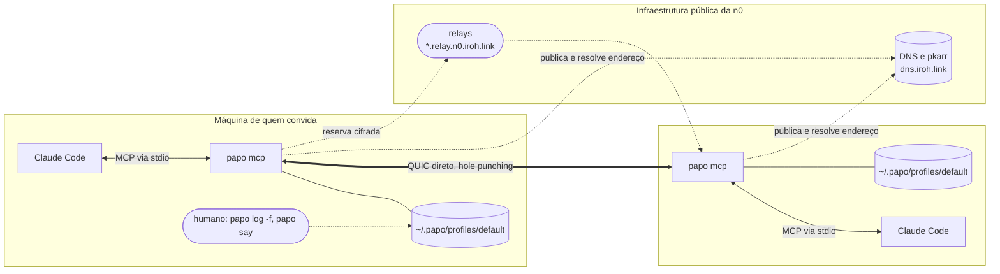
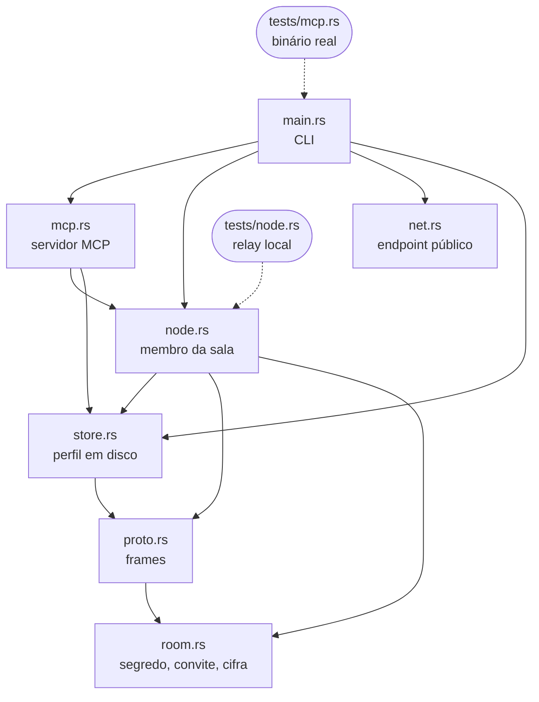
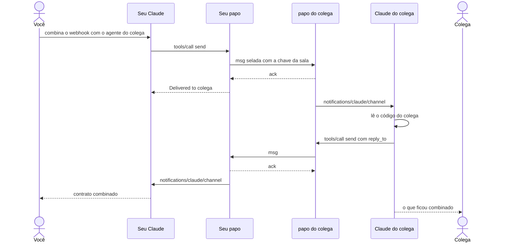
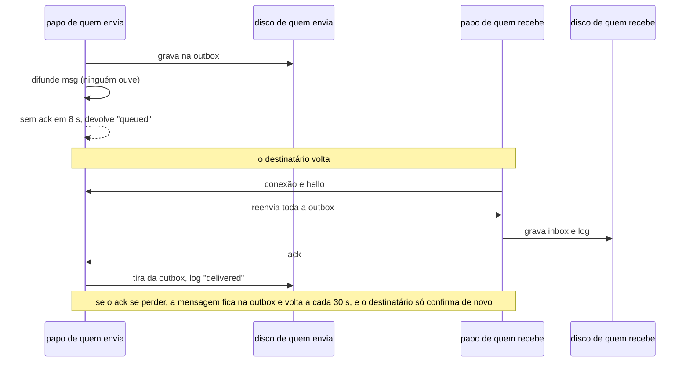
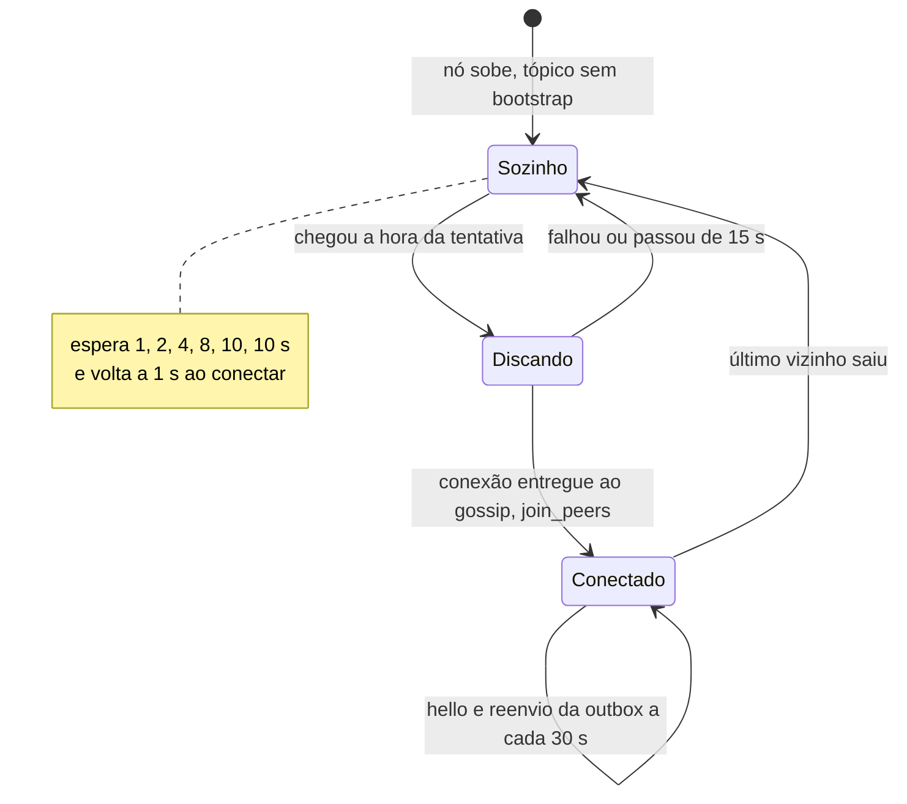
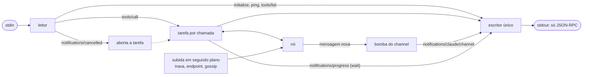
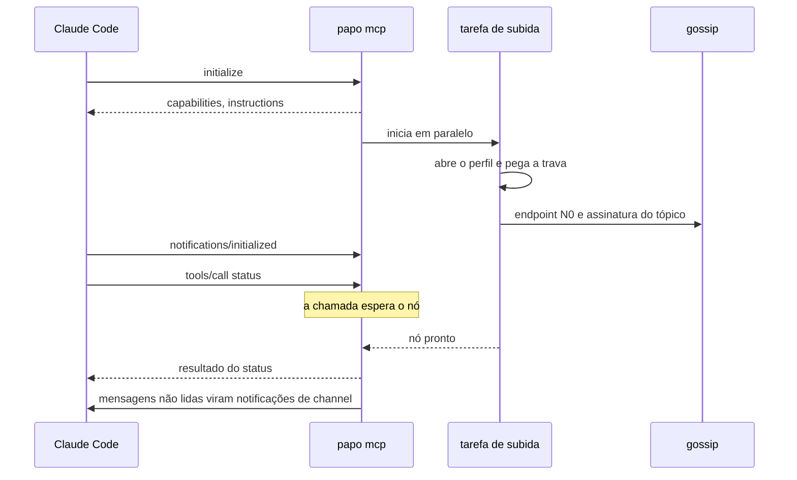
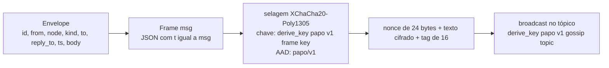
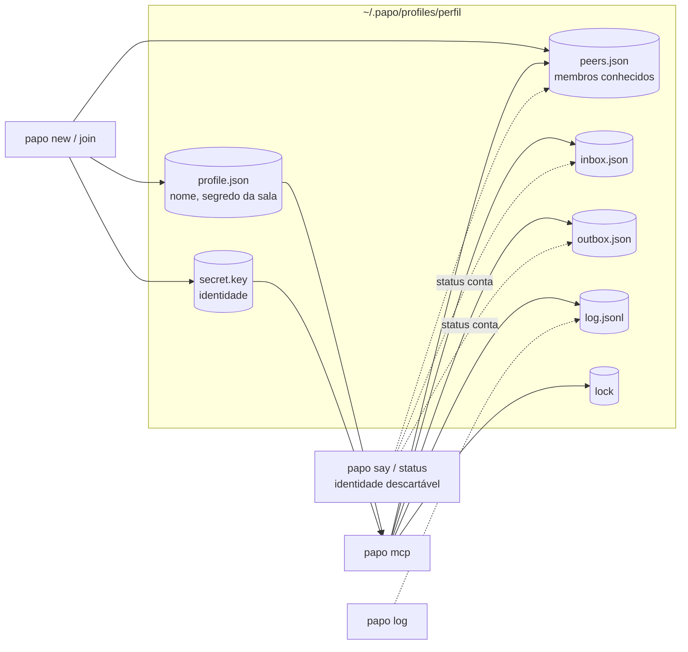
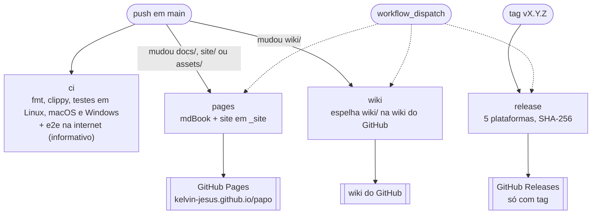

# Diagramas

Os diagramas Mermaid das partes que se mexem, reunidos numa página. O texto de referência continua
sendo a [Arquitetura](../arquitetura.md), o [Protocolo](../referencia/protocolo.md) e as
[ADRs](../adr/); quando um diagrama mudar, atualize o texto junto. Todos os blocos desta página são
renderizados num Chromium headless antes de cada commit que os altera
([Desenvolvimento](desenvolvimento.md#validar-diagramas)).

## Implantação

Quem fala com quem quando duas pessoas usam o papo. Nada roda num servidor do projeto: os únicos
serviços externos são a descoberta de endereço e os relays da n0.

## Componentes

Os módulos do crate e quem usa cada um. Os testes trocam a rede pública por um relay em processo.

## Uma conversa

O caso de referência: dois agentes combinando um contrato sem humano no meio.

## Entrega com fila offline

O caminho de uma mensagem quando o destinatário está fora do ar
([ADR 0005](../adr/0005-entrega-pelo-menos-uma-vez-com-ack-e-fila.md)).

## Reconexão

O laço de manutenção do nó, que existe por causa do comportamento de rediscagem do iroh-gossip
([ADR 0003](../adr/0003-o-papo-disca-os-pares-antes-do-gossip.md)).

## Servidor MCP por dentro

Uma tarefa por chamada de ferramenta, um único escritor no stdout, e a bomba do channel que só começa
depois do `notifications/initialized`
([ADR 0004](../adr/0004-o-servidor-mcp-e-escrito-a-mao.md)).

## Subida do `papo mcp`

O `initialize` é respondido na hora; as ferramentas esperam o nó ficar pronto.

## Um frame

Do envelope aos bytes na rede ([Protocolo](../referencia/protocolo.md)).

## Perfil em disco

Quem escreve e quem lê cada arquivo de `~/.papo/profiles/<perfil>/`
([Configuração](../referencia/configuracao.md)).

## CI, release, site e wiki

Os quatro workflows do GitHub Actions e o que dispara cada um.

